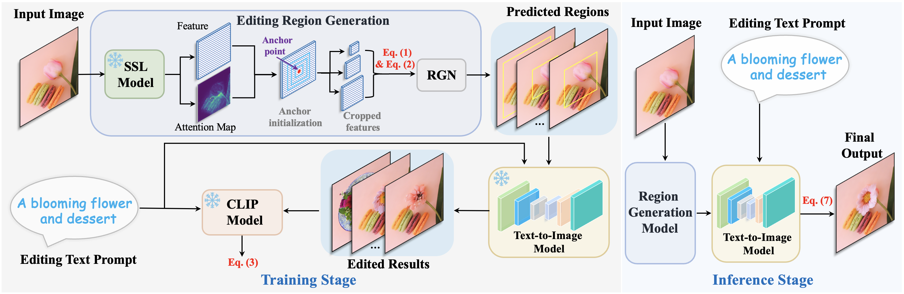
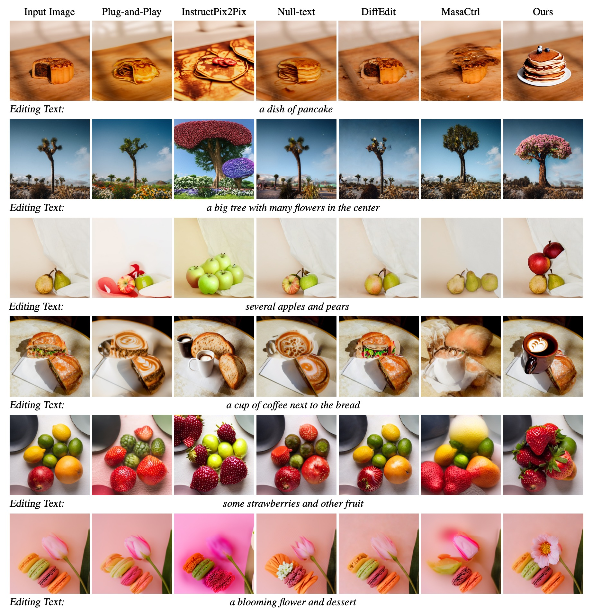
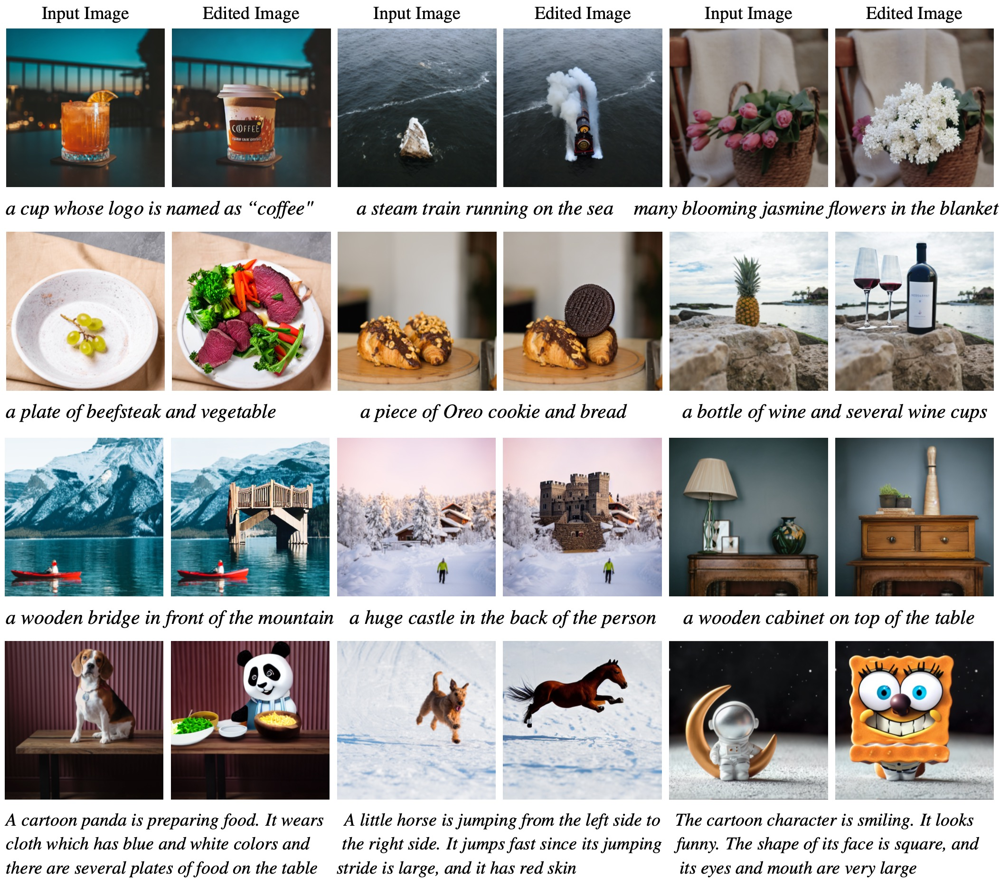
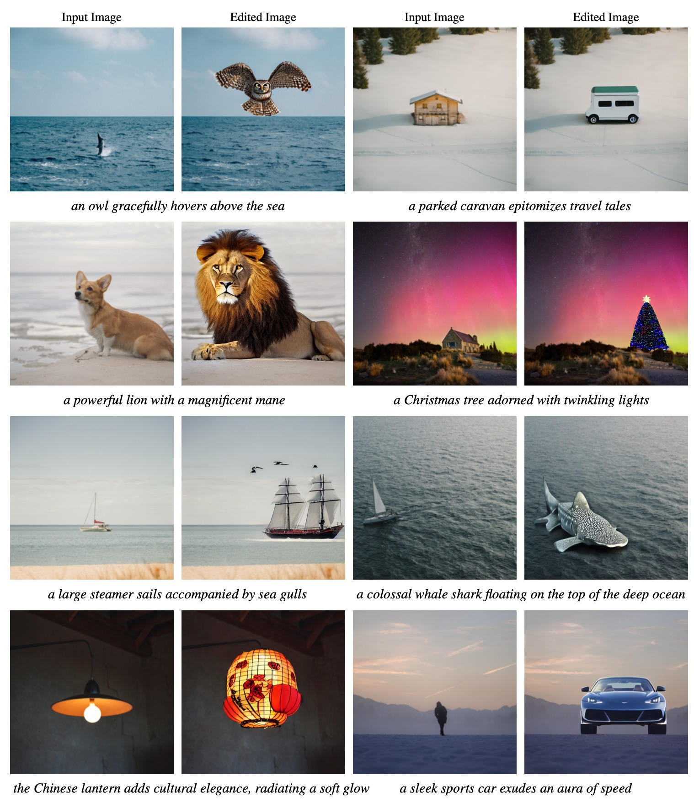

## Method Overview



## Contents

- [Install](#install)
- [Edit Single Image](#edit_single_image)
- [Edit Multiple Images](#edit_multiple_images)
- [Custom Image Editing](#custom_editing)

## Getting Started

### :hammer_and_wrench: Environment Installation <a href="#install" id="install"/>

To establish the environment, just run this code in the shell:

```
conda create -n LearnableRegion python==3.9 -y
source activate LearnableRegion
pip install torch==2.0.1 torchvision==0.15.2 torchaudio==2.0.2 --index-url https://download.pytorch.org/whl/cu118
conda env update --file enviroment.yaml
```

That will create the environment `LearnableRegion` we used.

### :tophat: Edit Single Image <a href="#edit_single_image" id="edit_single_image"/>

Run the following command to start editing a single image.

**Since runwayml has removed its impressive inpainting model ('runwayml/stable-diffusion-inpainting'),
if you haven't stored it, please set `--diffusion_model_path 'stabilityai/stable-diffusion-2-inpainting'`.**

```
torchrun --nnodes=1 --nproc_per_node=1 train.py \
	--image_file_path images/1.png \
	--image_caption 'trees' \
	--editing_prompt 'a big tree with many flowers in the center' \
        --diffusion_model_path 'stabilityai/stable-diffusion-2-inpainting' \
	--output_dir output/ \
	--draw_box \
	--lr 5e-3 \
	--max_window_size 15 \
	--per_image_iteration 10 \
	--epochs 1 \
	--num_workers 8 \
	--seed 42 \
	--pin_mem \
	--point_number 9 \
	--batch_size 1 \
	--save_path checkpoints/
```

The editing results will be stored in `$output_dir`, and the whole editing time of one single image is about 4 minutes with 1 RTX 8000 GPU.

You can tune `max_window_size`, `per_image_iteration` and `point_number` for adjusting the editing time and performance.

The explanation for the introduced hyper-parameters from our method:

> "**image_caption**": the caption of the input image, we just use class name in our paper.  
>  "**editing_prompt**": the editing prompt for manipulating the input image.  
> "**max_window_size**": max anchor bounding box size.  
> "**per_image_iteration**": training iterations for each image.  
> "**point_number**": number of sampled anchor points.  
> "**draw_box**": whether to draw bounding boxes of results for visualization or not, it will be saved into `$output_dir/boxes`.

### :space_invader: Edit Multiple Images <a href="#edit_multiple_images" id="edit_multiple_images"/>

Run the following command to start editing multiple images simultaneously.

**If you haven't downloaded the inpaiting model 'runwayml/stable-diffusion-inpainting' before it was closed, please just set `--diffusion_model_path 'stabilityai/stable-diffusion-2-inpainting'`.**

```
torchrun --nnodes=1 --nproc_per_node=2 train.py \
	--image_dir_path images/ \
	--output_dir output/ \
	--json_file images.json \
        --diffusion_model_path 'stabilityai/stable-diffusion-2-inpainting' \
	--draw_box \
	--lr 5e-3 \
	--max_window_size 15 \
	--per_image_iteration 10 \
	--epochs 1 \
	--num_workers 8 \
	--seed 42 \
	--pin_mem \
	--point_number 9 \
	--batch_size 1 \
	--save_path checkpoints/
```

### :coffee: How to Edit Custom Images? <a href="#custom_editing" id="custom_editing"/>

**Edit single custom image:** please refer to the command from `Edit Single Image`, and change `image_file_path`, `image_caption`, `editing_prompt` accordingly.

**Edit multiple custom images:** please refer to `images.json` to prepare the structure. Each key represents the input image's name,
the values are class/caption of the input image and editing prompt respectively, and then just run the above command from `Edit Multiple Images`.

## Comparison With Existing Methods



## Results Using Diverse Prompts


## Additional Results

